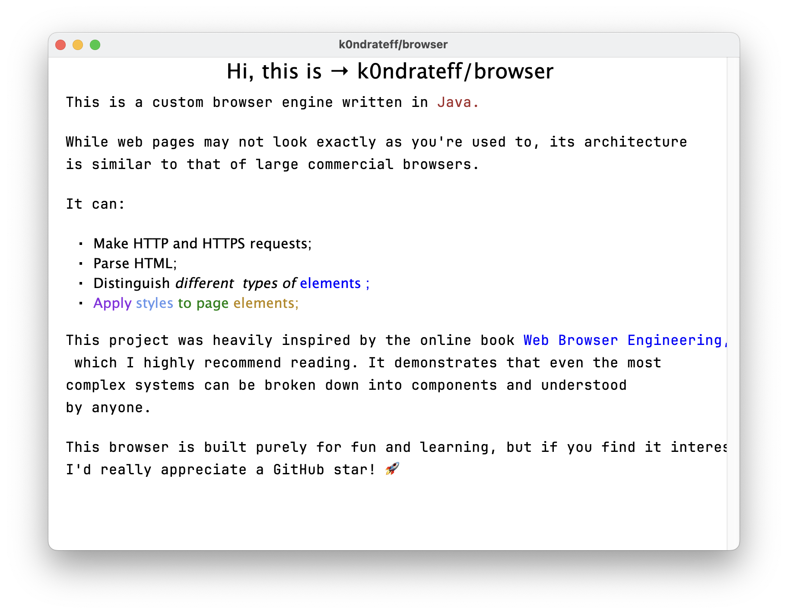

<h1 align="center">Hi, this is → k0ndrateff/browser</h1>



---

## Overview

This is a simple browser engine implemented in Java, developed as an educational project. This project is heavily inspired by the online book [Web Browser Engineering](https://github.com/browserengineering/book). The goal is to explore the fundamental concepts behind networking, web rendering, layout, and page navigation. Currently, browser can display simple web pages without custom layouts and styles. It is also incapable of interpreting JS, so SPA pages can look empty.

## Motivation

I am not a Java developer at all, but I wanted to experiment with building a browser engine for fun and learning purposes. This project serves as a way to understand the inner workings of a web browser, so you can freely surf through the code, exploring different concepts. If you are expert in Java development, feel free to leave an issue or pull request wih your changes.

## Installation and using

To run the project, ensure you have Java installed, then build and run JAR file:

```bash
./gradlew build   # on macOs/Linux

# OR

gradlew.bat build # on Windows
```

```bash
java -jar build/libs/k0ndrateff-browser-0.1.0.jar
```

Or you can just run JAR file from releases section of this repository.

By default, browser URL is set to "https://browser.engineering/", but you can change it by appending command line argument:

```bash
java -jar build/libs/k0ndrateff-browser-0.1.0.jar http://example.com/
```

## Features

At the moment, browser supports the following web technologies:

### Networking

1. HTTP requests
2. HTTPS (SSL) requests
3. Local file requests (_file://_ protocol)
4. Data requests (e.g. data:text/html,example)
5. HTTP redirects
6. HTTP caching (very basic)
7. HTTP content-encoding (gzip only)
8. HTTP transfer-encoding (chunked only)

### Parsing

1. HTML tree parsing
2. Attributes parsing (quoted attributes also supported)
3. HTML in-flight fixing (basic, using implicit tags)
4. Ignoring embedded scripts and comments
5. CSS parsing
6. Support for inline styles and external stylesheets

### Rendering

1. Block and inline layouts (naive implementation)
2. Automatic word-wraps
3. Preformatted text (`pre` tag)
4. Centered text
5. Re-rendering on window resize
6. Scrolling using arrow keys and mouse/touchpad (with repainting optimizations)

### Styles

1. `color` and `background-color` properties
2. Basic font-properties (`font-size`, `font-weight`, `font-style` and `font-family`)
3. Font cache
4. Styles inheritance
5. Cascading styles

...more features coming soon!

